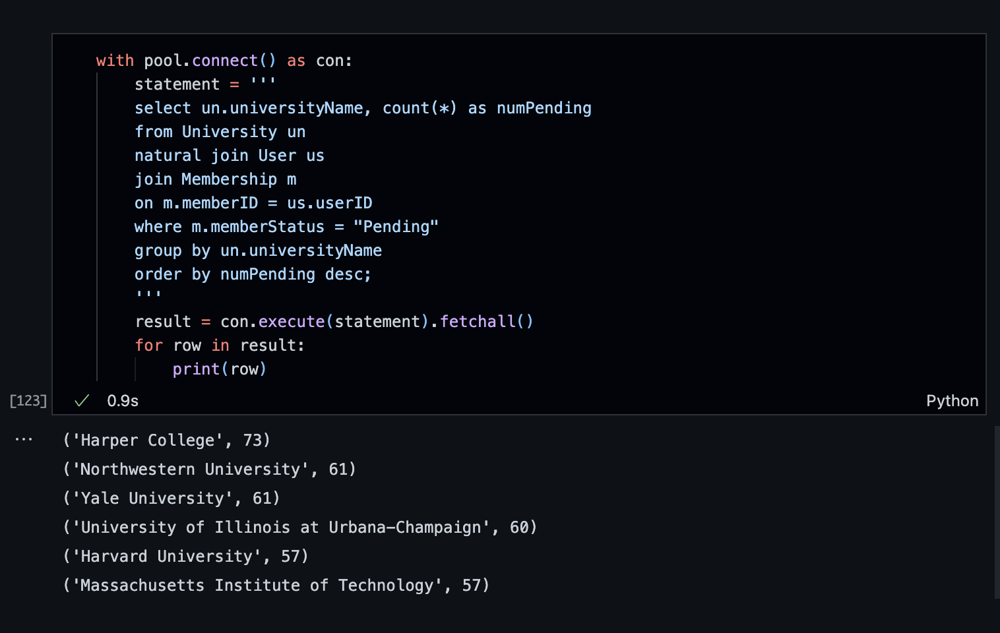

# Database Design

## DDL Commands

```sql
CREATE TABLE User (
    userID INT PRIMARY KEY, 
    userName VARCHAR(255), 
    email VARCHAR(255), 
    universityID INT,
    FOREIGN KEY (universityID) REFERENCES University(universityID)
);

CREATE TABLE Family (
    familyID INT PRIMARY KEY,
    leaderID INT, 
    accessType VARCHAR(255),
    serviceName VARCHAR(255),
    FOREIGN KEY (leaderID) REFERENCES User(userID), 
    FOREIGN KEY (serviceName) REFERENCES SubscriptionService(serviceName)
);

CREATE TABLE SubscriptionService (
    serviceName VARCHAR(255) PRIMARY KEY,
    price DECIMAL(10,2),
    maxMembers INT
);

CREATE TABLE University (
    universityID INT PRIMARY KEY, 
    universityName VARCHAR(255), 
    city VARCHAR(255)
);

CREATE TABLE Membership (
    memberID INT, 
    familyID INT,
    memberStatus VARCHAR(255),
    PRIMARY KEY (memberID, familyID),
    FOREIGN KEY (memberID) REFERENCES User(userID),
    FOREIGN KEY (familyID) REFERENCES Family(familyID)
);

CREATE TABLE BankAccount (
    accountName VARCHAR(255), 
    platform VARCHAR(255), 
    userID INT, 
    PRIMARY KEY (accountName, platform), 
    FOREIGN KEY (userID) REFERENCES User(userID)
);

CREATE TABLE Payment (
    paymentID INT PRIMARY KEY, 
    payerID INT, 
    recipientID INT, 
    amount DECIMAL(10,2), 
    paid BIT, 
    deadline DATE, 
    FOREIGN KEY (payerID) REFERENCES User(userID), 
    FOREIGN KEY (recipientID) REFERENCES User(userID)
);
```

## Advanced Queries

### Query 1

Our first query returns the number of pending user invitations per university. We first join the `University` table with the `User` table, then group by the `universityID`. We order the outputby descending number of users. 

#### Code
```sql
select un.universityName, count(*) as numUsers
from University un
natural join User us
group by un.universityID
order by numUsers desc;
```

#### Result


### Query 2

Our second query returns the number of accepted users for every university and subscription service. We begin by joining the `User`, `Membership`, `Family`, `SubscriptionService`, and `University` tables. We then filter by accepted members, and group by both `universityID` and `serviceName`. We order the output by the `universityName` in ascending order and aggregated `numUsers` in descending order. Finally, we limit the length of the output to 15 rows for visualization. 

#### Code
```sql
select un.universityName, ss.serviceName, count(*) as numUsers
from User us
join Membership m
    on m.memberID = us.userID
natural join Family f
natural join SubscriptionService ss
natural join University un
where m.memberStatus = "Accepted"
group by un.universityID, ss.serviceName
order by un.universityName asc, numUsers desc
limit 15;
```

#### Result
