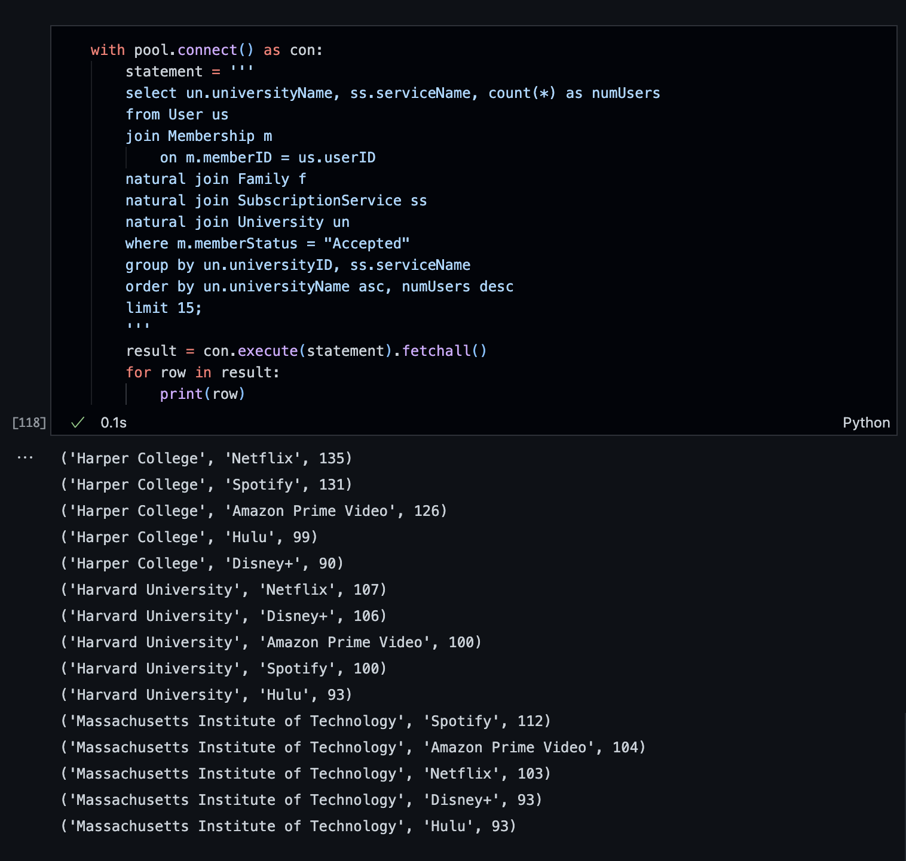

# Database Design

## DDL Commands

```sql
CREATE TABLE User (
    userID INT PRIMARY KEY, 
    userName VARCHAR(255), 
    email VARCHAR(255), 
    universityID INT,
    FOREIGN KEY (universityID) REFERENCES University(universityID)
);

CREATE TABLE Family (
    familyID INT PRIMARY KEY,
    leaderID INT, 
    accessType VARCHAR(255),
    serviceName VARCHAR(255),
    FOREIGN KEY (leaderID) REFERENCES User(userID), 
    FOREIGN KEY (serviceName) REFERENCES SubscriptionService(serviceName)
);

CREATE TABLE SubscriptionService (
    serviceName VARCHAR(255) PRIMARY KEY,
    price DECIMAL(10,2),
    maxMembers INT
);

CREATE TABLE University (
    universityID INT PRIMARY KEY, 
    universityName VARCHAR(255), 
    city VARCHAR(255)
);

CREATE TABLE Membership (
    memberID INT, 
    familyID INT,
    memberStatus VARCHAR(255),
    PRIMARY KEY (memberID, familyID),
    FOREIGN KEY (memberID) REFERENCES User(userID),
    FOREIGN KEY (familyID) REFERENCES Family(familyID)
);

CREATE TABLE BankAccount (
    accountName VARCHAR(255), 
    platform VARCHAR(255), 
    userID INT, 
    PRIMARY KEY (accountName, platform), 
    FOREIGN KEY (userID) REFERENCES User(userID)
);

CREATE TABLE Payment (
    paymentID INT PRIMARY KEY, 
    payerID INT, 
    recipientID INT, 
    amount DECIMAL(10,2), 
    paid BIT, 
    deadline DATE, 
    FOREIGN KEY (payerID) REFERENCES User(userID), 
    FOREIGN KEY (recipientID) REFERENCES User(userID)
);
```

## Advanced Queries

### Query 1

Our first query returns the number of pending user invitations per university. We first join the `University` table with the `User` table, then group by the `universityID`. We order the outputby descending number of users. 

#### Code
```sql
select un.universityName, count(*) as numUsers
from University un
natural join User us
group by un.universityID
order by numUsers desc;
```

#### Result


#### Initial Performance 

Below is the performance of our query without any added indexes. Between each index, we made sure to drop the added index from the previous part, to ensure standardization between comparisons. 


#### Index 1

For our first index design, we added an index on `Membership.memberStatus` because we filter on that column in the query. 

```sql
alter table Membership add index memId(memberStatus);
```

The output of our analyze query follows: 


We see a speedup in the "Filter" command that addresses `m.memberStatus = "Pending"`, and an overall speedup in the whole query, so we can conclude that this index is a good optimization to add for this specific query. 

#### Index 2

For our second index design, we added an index on `University.universityName` because we use it in the grouping step of our query. 

```sql
alter table University add index uniName(universityName);
```

The output of our analyze query follows: 


We see some marginal performance improvement on the aggregation step of the query, which means that we could still use this index design as well. 

#### Index 3

For our third index design, we added an index on `User.userID`, which is used to join the two tables. 

```sql
alter table User add index useId(userID);
```

The output of our analyze query follows: 


We again see some improvement in the actual time of both the single iteration and total iteration times of the nested loop inner join. We actually also see speedups in the sort and aggregation processes, so this is also a good index to add for our query. 

### Query 2

Our second query returns the number of accepted users for every university and subscription service. We begin by joining the `User`, `Membership`, `Family`, `SubscriptionService`, and `University` tables. We then filter by accepted members, and group by both `universityID` and `serviceName`. We order the output by the `universityName` in ascending order and aggregated `numUsers` in descending order. Finally, we limit the length of the output to 15 rows for visualization. 

#### Code
```sql
select un.universityName, ss.serviceName, count(*) as numUsers
from User us
join Membership m
    on m.memberID = us.userID
natural join Family f
natural join SubscriptionService ss
natural join University un
where m.memberStatus = "Accepted"
group by un.universityID, ss.serviceName
order by un.universityName asc, numUsers desc
limit 15;
```

#### Result


#### Initial Performance 

Below is the performance of our query without any added indexes. Between each index, we made sure to drop the added index from the previous part, to ensure standardization between comparisons. 


#### Index 1

For our first index design, we added an index on `Membership.memberStatus` because we filter on that column in the query. 

```sql
alter table Membership add index memId(memberStatus);
```

The output of our analyze query follows: 


This time around, we find that the new index actually slows down both the individual runtime of our filtering step and the runtime of the overall query, so this would not be a good index to add to optimize our second query. 

#### Index 2

For our second index design, we added an index on `Family.familyID` because it is used to join the `Family` table with the `Membership` table. 

```sql
alter table Family add index famId(familyID);
```

The output of our analyze query follows: 


We find a significant improvement from using the new index. There is a cascaded speedup in the runtime of all of the nested inner joins, and a resulting speedup on the overall query as well, shown at the bottom.

#### Index 3

For our third index design, we tried a similar approach as the previous indexing step, adding an indexing to `Membership.memberID`, which is used in one of the inner joins. 

```sql
alter table Membership add index memId(memberID);
```

The output of our analyze query follows: 


We find an even bigger improvement by using the `memberID` index, again both in the several inner joins, and in the query as a whole, more than halving the runtime. As a result, we might next try to implement both indexes at once, to increase the speedup of the query even further, but this would need to be analyzed again to be sure. 